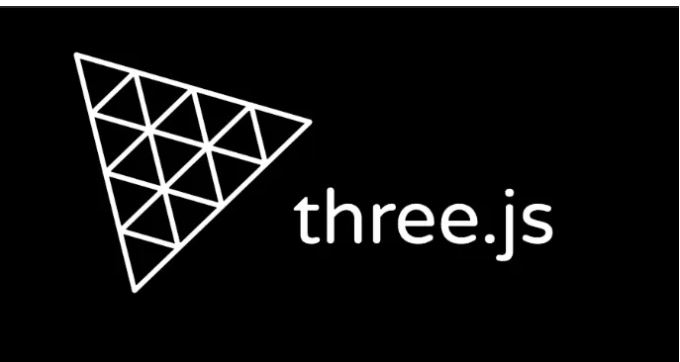

# Seat Ibiza 2022 - Interactive 3D Inspection Demo

A Three.js + TypeScript portfolio demo inspired by BIM/Dalux-style viewers.
It loads a Seat Ibiza 2022 model and provides navigation, inspection, issue tracking,
measurement, clipping, exploded view, move interaction, and staged lighting controls.

## Tech Stack

- Vite
- TypeScript (strict)
- Three.js

## Features

- Progressive loading strategy:
  - Shows a low-detail preview first (real proxy if present, otherwise generated from high model)
  - Automatically swaps to high-detail on idle with a fade transition
  - LOD status is shown in the Tools section
- Interaction modes:
  - `Navigate` (orbit and zoom)
  - `Move` (drag car on XZ plane with pointer events)
  - `Select` (inspect mesh metadata)
  - `Issue` (create issue pins with title/severity/notes and camera snapshot context)
  - `Measure` (two-point distance)
  - `Clip` (axis-aligned clipping plane)
- Exploded view:
  - Slider from `0` to `1`
  - Group-based explode directions (Body, Wheels, Doors, Interior, Lights)
  - Reset button for exploded state
- Lighting:
  - Stage light strength slider (`0` to `20x`)
  - Click stage lights to select/toggle and rotate with transform gizmo
  - Additional ambient/key/fill/rim lighting
- Scene and UI:
  - Dark/Light theme toggle
  - Global Reset button in HUD
  - FPS and total triangle counters
  - Model and spotlight credits with clickable links

## Project Structure

- `index.html`: UI layout (HUD + tools panel)
- `src/main.ts`: scene setup, loading flow, tool wiring, interactions
- `src/ui.ts`: DOM bindings and UI event API
- `src/style.css`: styling
- `src/tools/selection.ts`: mesh classification + selection highlight
- `src/tools/layers.ts`: category visibility and persistence
- `src/tools/issues.ts`: issue pin lifecycle + export
- `src/tools/measure.ts`: measurement markers and line
- `src/tools/clipping.ts`: local clipping plane management
- `src/tools/lod.ts`: progressive model loading / proxy-high swap
- `src/tools/explode.ts`: grouped exploded transform logic
- `src/tools/move.ts`: ground-plane drag movement

## Requirements

- Node.js 18+ (recommended)
- npm

## Setup

```bash
npm install
```

Required models:

```text
public/models/seat_ibiza_2022.glb
public/models/stage_light_zoom_spot.glb
```

Optional proxy model:

```text
public/models/seat_ibiza_2022_proxy.glb
```

If the proxy file is missing, the app generates a simplified proxy from the high-detail model.

## Run

```bash
npm run dev
```

Open the local Vite URL shown in the terminal.

## Build and Preview

```bash
npm run build
npm run preview
```

## Persistence and Reset

The app stores theme, layer state, and issues in `localStorage`.

The HUD `Reset` button:

- clears issues, measurements, clipping, explode state, selection, and transforms
- restores default camera/tool/theme/light settings
- calls `localStorage.clear()` for the current origin

## Troubleshooting

- Model not loading:
  - verify `public/models/seat_ibiza_2022.glb` exists
- Spotlight model missing:
  - verify `public/models/stage_light_zoom_spot.glb` exists
- Slow performance:
  - use a real low-poly proxy model (`seat_ibiza_2022_proxy.glb`)
  - reduce model complexity or texture sizes

## Credits

- Car model: Ddiaz Design - https://skfb.ly/ptVUo
- Spotlight model: Mike Rowley - https://skfb.ly/M6TS



