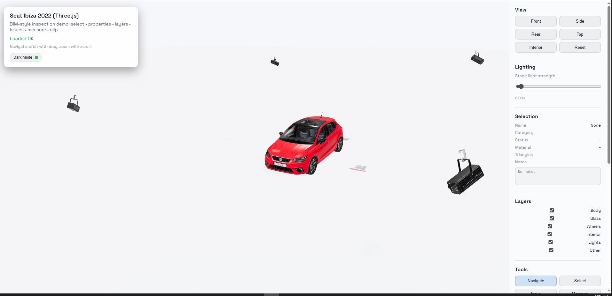

# Seat Ibiza 2022 � Interactive 3D Inspection Demo

A production-style Three.js viewer inspired by BIM workflows. This project is a portfolio-quality demo that combines BIM-like inspection tools with interactive lighting and scene controls for a Seat Ibiza 2022 GLB model.

## What This Demo Includes

- **BIM-style inspection tools**
  - Selection + properties panel
  - Category layers with visibility toggles (persisted)
  - Issue pins with metadata, thumbnails, and export
  - Measurement tool (distance between points)
  - Clipping tool (X/Y/Z plane)

- **Interactive lighting**
  - 5 stage spotlights around the car
  - Click a light to select it, rotate it with XYZ gizmo
  - Global lighting strength slider

- **Scene extras**
  - OrbitControls + auto-fit camera
  - Ground plane and decals (logo + �Fathi� name)
  - Dark / Light mode toggle

## Setup

1) Create the Vite project (vanilla TypeScript):

```bash
npm create vite@latest seat-ibiza-demo -- --template vanilla-ts
cd seat-ibiza-demo
```

2) Install dependencies:

```bash
npm install
npm install three
```

3) Copy these files into the project:

- `index.html`
- `src/style.css`
- `src/main.ts`
- `src/ui.ts`
- `src/tools/selection.ts`
- `src/tools/layers.ts`
- `src/tools/issues.ts`
- `src/tools/measure.ts`
- `src/tools/clipping.ts`
- `README.md`

4) Place the model files here:

```
public/models/seat_ibiza_2022.glb
public/models/stage_light_zoom_spot.glb
```

5) Optional assets (already referenced in this repo):

```
public/assets/background.png
public/assets/Groundi.png
public/assets/png-clipart-seat-ateca-logo-car-seat-angle-text-removebg-preview.png
```

6) Run the dev server:

```bash
npm run dev
```

## Usage

- **Navigate**: drag to orbit, scroll to zoom
- **Select**: click a mesh to inspect metadata
- **Issue**: click the model to place a pin and fill out the issue form
- **Measure**: click two points to measure distance
- **Clip**: choose axis and move the slider to slice the model
- **Rotate Model** (Tools): enables XYZ gizmo on the car
- **Spotlights**: click a spotlight to rotate it and toggle it
- **Lighting**: adjust the global stage light strength slider
- **Theme**: use the Light/Dark toggle in the HUD

## Troubleshooting

- **404 model path**: Ensure the file is exactly at `public/models/seat_ibiza_2022.glb` (case sensitive).
- **Spotlights missing**: Ensure `public/models/stage_light_zoom_spot.glb` exists.
- **CORS**: Not relevant for the local `public` folder in Vite.
- **Huge model performance**: Decimate meshes, resize textures, or compress the GLB (e.g., Draco/meshopt).
- **Texture warnings**: If you see GPU texture warnings, the demo already strips extra PBR maps to reduce texture unit usage.

## Notes

- Issues are stored in `localStorage` and exported as JSON (thumbnails stored separately in localStorage).
- Layers visibility is persisted in `localStorage`.
- The car is snapped to ground using filtered mesh bounds to avoid floating.



(public/assets/1_m0zrCLd2wY29-jHaxYsgA.png)
